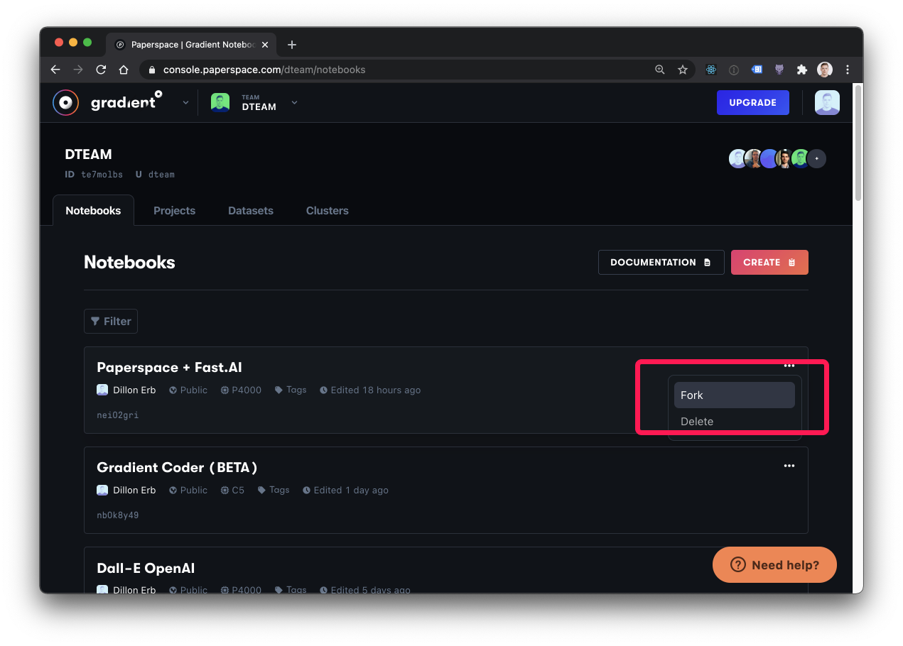

# Fork a Notebook

## Fork your Notebook

Forking is a great way to make a copy of your Notebook, to save a version of it that you may want to go back to in case you expect to make major changes. Forking a notebook creates a new history for your notebook. The files copied to your notebook are those listed in your [notebook include file](https://github.com/Paperspace/Docs/tree/9f5869e1aef4b75067075530e65c9764279782bf/notebook-include.md). This can copy notebooks, including public notebooks, into a team.



1. Within the Notebook IDE


  2. From the notebook list view



You will see an exact copy of your notebook appear at the top of your Notebooks list.



After the fork there will be a stopped notebook created in your team. You must call `gradient notebooks start --id ID` to run it.

### Usage

```bash
gradient notebooks fork [OPTIONS]
```



