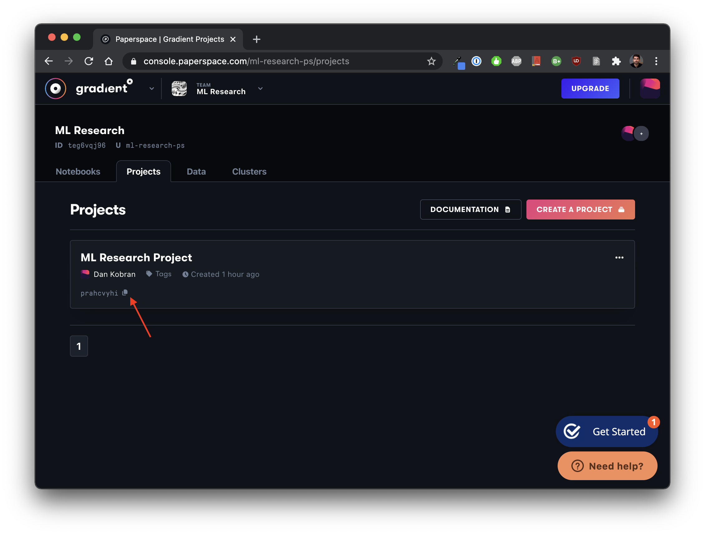

# Organizing Projects

A Gradient Project is a workspace for you or your team to run Workflows, store Models, and manage Deployments. Projects create an additional isolation layer of organization and control \(e.g. managing access\) within your team.  You can [create a project](./#create-a-project) in the web UI or the CLI.

You can create a project that integrates with a Github project or a standalone project.  Use a **Github project** if you already have code you are working with in **Github** and you want to use it with **Gradient** via a **Workflow**.  
  
If you are part of the early evaluation for **Github projects** you will see this screen when you navigate to the **Projects** tab:


From here follow the instructions on the page to install the Gradient **Github App** into your Github account, and select git repo you want to associate with project.  Alternatively you can select one of the **sample repos** from the tiles on the right.  There is also a link on the **Create Project** page to create a **standalone project** \(not Github connected\) if desired.

If you are not part of the early evaluation for **Github projects**, navigate to **Projects** and follow these instructions.  Otherwise, continue with [**Get Your Project's ID**](./#get-your-projects-id).

## Create a Project



On the [Projects page](https://console.paperspace.com/projects), click _Create Project_.


Provide a name and then click _Create Project_.





The following command creates a Project called `ExampleProject` 

```
gradient projects create --name ExampleProject [OPTIONS]
```

#### Parameters: 

| Option | Description |
| :--- | :--- |
| `--name` | Name of new project \[required\] |
| `--repositoryName` | Name of the repository |
| `--repositoryUrl` | URL to the repository |
| `--apiKey` | Key to use this time only |
| `--help`  | Help for this feature |



## Get Your Project's ID

A Project's ID is a required parameter for several commands within Gradient.



To find the ID, click the ID in the Projects list to copy it to your clipboard:





To get a Project ID, you can use the following command:

```bash
gradient projects list
```



## Managing access to a Project

To add other team members to a project, click any Project in the projects list to navigate to its Project details page and then click the Accessors tab:


On the Accessors tab you will find a list of users who already have access to the Project. Add an Accessor by clicking the "Manage" button on the right side of the page. Assign other team members to the Project by selecting their name in the drop-down and clicking on "Assign User":


You can also remove members' access to a Project by clicking the "Remove Access" button next to the member's name.


Note: Only existing team members will be displayed in the drop-down list. Only Team admins can add additional team members to this list.

Additionally, project access can only be controlled through the web console – Accessors cannot be added or removed through the Gradient CLI.


## Deleting a Project



You can delete a project by visiting the project's `Settings` page and hitting the `Delete Project` button.  





To delete a Project, you can use the following command:

```bash
gradient projects delete --id <project id>
```



