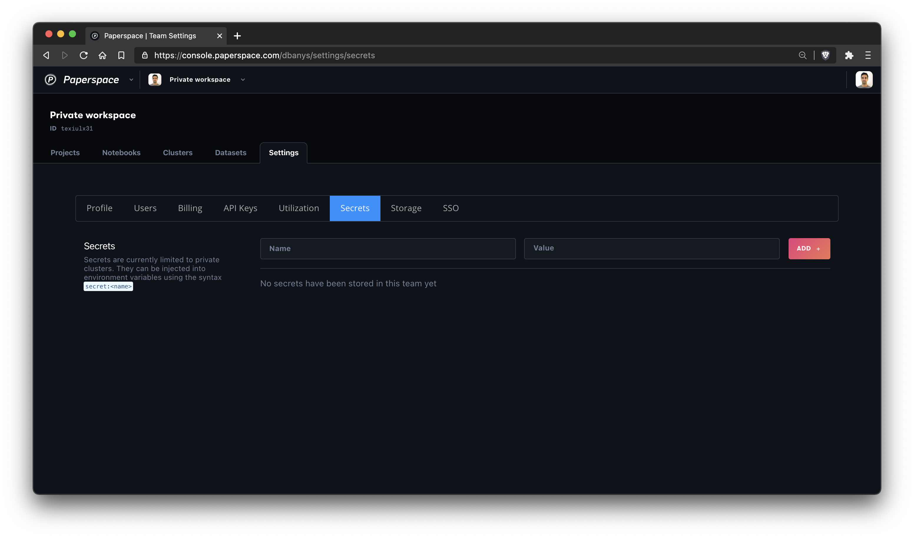
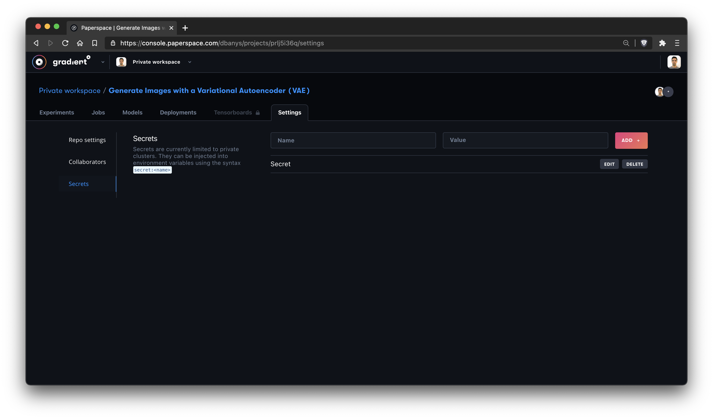

# Secrets

### Managing and Using Secrets

Secrets allow you to store sensitive information at the team, private cluster, and project level. The secrets you create are available to use in experiments run on private clusters.

Secrets can be created at the following levels:

* Team: these secrets are applied to all projects and all clusters
* Project: these secrets are applied to all experiments in a project
* Cluster: these secrets are applied to all experiments in a cluster

Secrets can be set from the Settings tab in the web UI or through the CLI.


View the full CLI/SDK Docs for **Secrets** here [https://paperspace.github.io/gradient-cli/gradient.cli.html\#gradient-secrets](https://paperspace.github.io/gradient-cli/gradient.cli.html#gradient-secrets)


#### Set a Secret



Navigate to the project, cluster, or team page and click the **Secrets** tab. Click the **Create Secret** button, enter the secret name and value, and click the **Create Secret** button to save.





Set team secret

```text
gradient secrets set team --name=<name> --value=<secret>
```

Set project secret

```text
gradient secrets set project --id=<project_id> --name=<name> --value=<secret>
```

Set cluster secret

```text
gradient secrets set cluster --id=<cluster_id> --name=<name> --value=<secret>
```



#### List Secrets



Navigate to the project or team page and click the **Secrets** tab.





List team secrets

```text
gradient secrets list team
```

List project secrets

```text
gradient secrets list project --id=<project_id>
```

List cluster secrets

```text
gradient secrets list cluster --id=<cluster_id>
```



#### Delete a Secret



Navigate to the project, cluster, or team page and click the **Secrets** tab. Click the **Delete** button and confirm the dialog.





Delete team secret

```text
gradient secrets delete team --name=<name>
```

Delete project secret

```text
gradient secrets delete project --id=<project_id> --name=<name>
```

Delete cluster secrets

```text
gradient secrets delete cluster --id=<cluster_id> --name=<name>
```



#### **Secret scoping**

If the same secret name is created for more than one scope only one will be applied. Secrets have the following precedence: Project &gt; Cluster &gt; Team.

