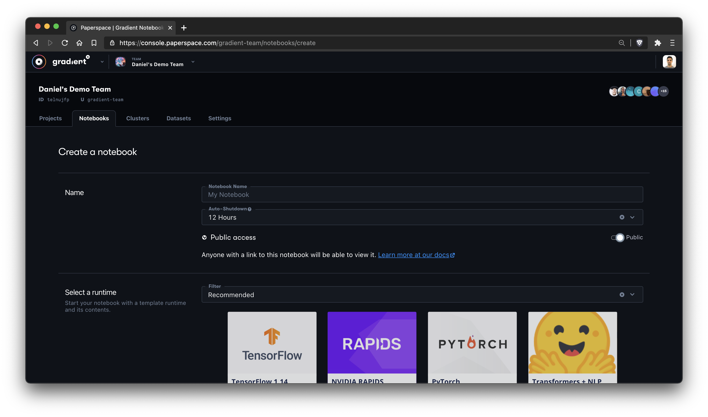

# Quick Start

## Prerequisites


This section of the documentation covers our previous generation of Gradient. For the current version go to [Gradient Next](https://docs.paperspace.com/gradient).


To begin using Gradient, follow these preliminary steps:

1. [Create a Paperspace account ](https://www.paperspace.com/account/signup)
2. [Create a team if higher tiers of service and collaboration features are desired](https://support.paperspace.com/hc/en-us/articles/360010359213-Creating-and-Managing-Paperspace-Teams)
3. [Install the Gradient CLI ](install-the-cli.md#installation)
4. [Connecting your account](install-the-cli.md#connecting-your-account)

Now you can create Notebooks, Jobs, Projects, Experiments, Models, Deployments, and more!

Note: if you are a Gradient Private Cloud user, please visit the [Gradient Private Cloud section](https://docs.paperspace.com/gradient/gradient-private-cloud/about) for more info on how to utilize private processing site clusters.

## Logging into the Paperspace Console for the first time

When you first log into the Paperspace Console, you'll choose Gradient or Core, depending on whether you want to perform machine learning or to use cloud infrastructure directly.

You can always switch products later by clicking the Product Selector at the top-left of the Console and then selecting Gradient, Core, or your Paperspace Teams & Account settings.


## Create a Notebook

Notebooks can be created on the Notebooks tab. Just select a [template](../notebooks/create-a-notebook/notebook-containers/), choose your [instance type](../instances/instance-types/), and then click create.


Check out the [FREE GPU](../instances/instance-types/free-instances.md) option when launching Notebooks!





Check out the [ML Showcase](https://ml-showcase.paperspace.com/) for a list of projects you can fork into your own account


You can stop, start, fork, and swap out the instance type anytime. Choose from a wide selection of pre-configured templates or bring your own.



## Advanced MLOps

### Create a cluster

[Gradient Private Clusters](../gradient-private-cloud/setup/managed-installation.md) allow you to execute Experiments, Jobs, Deployments, and other workloads. To create a cluster, navigate to the [clusters](https://console.paperspace.com/clusters) page and select **Create Managed Cluster**.


### Create a Project

Projects organize your work. To create a Project, navigate to **Gradient** &gt; **Projects** in the UI and click **Create Project**. Then select **Create Standalone Project** and provide a project name. Now, you can use the created Project's **Project ID** in order to create Experiments in that Project via the CLI.


### Running your first Experiment

You can run Experiments from the web interface or CLI:


Before creating an experiment using the CLI, you must first [install the CLI](install-the-cli.md).


**Example command**

The following command will work and will create and start an Experiment that will display properties of the attached GPU. Be sure to replace `<your-project-id>` with your **Project ID** and `<your-cluster-id>` with your **Cluster ID**.


**Note:** We recommend stashing your API key with `gradient apiKey XXXXXXXXXXXXX` or you can add your API key as an option on each Experiment. See [Connecting Your Account](install-the-cli.md#connecting-your-account).


```bash
gradient experiments run singlenode --projectId <your-project-id> --clusterId <your-cluster-id> --container 'Test-Container' --machineType P4000 --command 'nvidia-smi' --name 'test-01' --workspace none --apiKey <your-api-key>
```


Behind the scenes, your Experiment will be uploaded and executed on your cluster starting with the command you provided. There are [several optional Experiment parameters](../experiments/using-experiments/), such as to specify your **workspace** \(the additional files to be used in your experiment\). You can always use the `--help` option after any command in the CLI for more info.

You can also create `multi-node` and leverage other advanced functionality such as [Tensorboards](../tensorboards/using-tensorboards/getting-started-with-tensorboards.md) and [Metrics](../metrics/metrics-overview.md). Explore all the advanced options [here](../experiments/using-experiments/experiment-options.md).

### Monitor your Experiment progress

Experiments states transition from **Queued** &gt; **Pending** &gt; **Running**. Once the Experiment is in the **Running** state, you can watch your Experiment run in the CLI and web UI. An Experiment can complete with the following states: **Success, Cancelled, Error,** or **Failed**.

Congratulations! You ran your first Experiment on Gradient 🚀

## Explore the rest of the platform

From [Models](../models/about.md) to [Deployments](../deployments/about.md), there's a lot more to the Gradient platform. We recommend using the Web UI to explore the primary components and also be sure to install the [CLI](install-the-cli.md) and check out the [SDK](../gradient-python-sdk/gradient-python-sdk/).

Here's a sample project that exercises most of the components of the platform:



