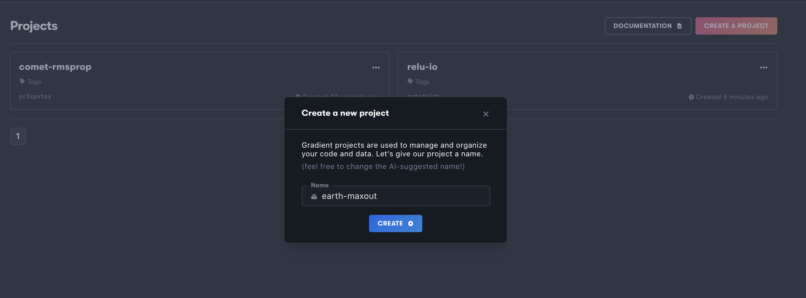
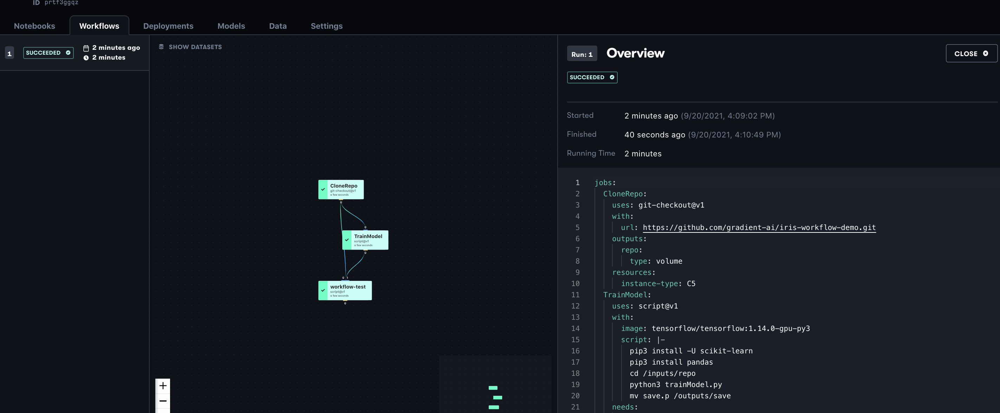

# Getting Started: Build and Run a Custom Workflow

### Overview

This tutorial breaks down how to create and use a classical decision tree classifier for the [Iris dataset](https://archive.ics.uci.edu/ml/datasets/iris) using Gradient Workflows with the Workflows UI and the Gradient CLI. This project was constructed to provide a framework for new users to create their first custom Workflow after following our sample Workflow tutorial. 

### Context 

Workflows are designed to help you automate machine learning tasks. Workflows can be used independently or in conjunction with Notebooks and Deployments. 

For this tutorial, we will assume that we've done some initial exploration and cleaning up of the dataset, a popular and pre-set up dataset provided by Sci-Kit Learn, in Notebooks and we now want to take our findings to the training or production phase in Workflows. 

Iris classification is often one of the first ML tasks given to new data scientists. Use this process of setting up a simple Iris Decision Tree Classifier to learn how you can apply Workflows to assess your ML pipelines prior to deployment.

You can find a link for the repo you will be using [here](https://github.com/gradient-ai/ClipIt-PixelDraw/).

### What You Will Learn

In this tutorial, we will show how to apply Notebook findings to an automatic, iterative training process using Workflows and the accompanying [YAML Workflow spec](../../explore-train-deploy/workflows/using-yaml-for-data-science.md). After running a successful Workflow, we will discuss possibilities for expanding the tutorial to include additional Workflow steps.

### Getting Started

Go to the [sample repo](https://github.com/gradient-ai/iris-workflow-demo) and fork it to your GitHub. You will need these files later to recreate the Workflow.


If you want to skip ahead to a more advanced tutorial, we recommend you try [Deep Learning Recommenders in TensorFlow,](end-to-end-example.md) which is an end-to-end tutorial with a deeper focus on data preparation and transformation.


### Install the Gradient CLI

If you have not already done so, first install the Gradient CLI on your local machine

```text
pip install -U gradient
```

After installing the CLI, you will need to [generate an API key](../managing-projects/storing-an-api-key-as-a-secret.md#1-create-a-new-api-key) and pass it to the Gradient CLI like so: 

```text
gradient apiKey your_api_key
```

If you need help finding your API keys, you can use the pull down menu in the top right of the Gradient user interface and select `Team Settings` &gt; `API Keys`.



### Connect the Repo in GitHub for your Workflow 

Next, go into the terminal and navigate to where you want your directory to be on your local machine, and clone the files from your fork of the [sample GitHub repo](https://github.com/gradient-ai/iris-workflow-demo) into your new directory. Within the terminal, change to this directory.

Within this repo are three files of interest:  trainModel.py, model\_iris.py, and workflow.yaml. These three files will dictate our Workflow.

* trainModel.py: this script instantiates a decision tree classifier, fits it to the Iris dataset, and pickles the model.
* model\_iris.py: takes in the pickled model from trainModel, generates predicted values for the target feature, and outputs them in a DataFrame along with the actual values for the target.
* workflow.yaml: consists of three jobs: cloning the iris-workflow-demo repo, training the model, and generating the predictions and outputting the results. 

### Create a Project

Within your team of choice on Gradient, select the projects tab.  From the Projects tab in the Gradient console, select `Create Project`. Name your Project, and be sure to save the associated ID for later use.  

You can also create a project in the terminal with the following: 

```text
 gradient projects create --name your_project_name
```


### Create your Workflow

Go back to the browser. Navigate to the Workflows tab, once you are in your new project. Select `Create` to make your Workflow. 


Select your GitHub account in the "Select account or organization" box, and enter in your forked repo as the repository name. In the "Select a template" section, click the link "insert an existing repository" to be taken to a drop down menu where you can select your new repo. Import your repo.

From there, you will be taken to the "Let's create a Workflow" page. This is where you can begin to customize the Workflow.

### Instantiating the Data Store

Now we will instantiate our data store using [persistent storage](../../data/data-overview/persistent-storage.md) for the dataset. 

You may create an Iris dataset in storage by entering the following into the the terminal:

```text
gradient datasets create --name iris --storageProviderId splpgnqdraabg8u
```

Note: `splpgnqdraabg8u` is the id corresponding to Gradient persistent storage. You can use other storage providers with S3 compatible object storage buckets, AWS S3, Google GCS, MinIO, or similar. 

The terminal will return a dataset id like so:

```text
Created dataset: your_dataset_id
```

Be sure to save this dataset id: you will need it to store your outputted dataset. 

## Executing the Workflow

### Create the Workflow 

Finally, we can execute our Workflow run. You can do this by entering the following into the terminal to create the Workflow 

```text
gradient workflows create -projectID your_prokect_id --name your_workflow_name
```

This should the output your new Workflow like so:


### Run the Workflow

Now, to run the Workflow, all you need to do is enter "gradient workflows run" with your new Workflow id and path into the terminal. 

```text
gradient workflows run --id your_workflow_id --path ./workflow.yaml
```

You can then look at your Workflow in the browser, and it should look like so:



To look at your outputted data, select the "workflow-test" job and navigate to it's data tab. Then select the link within the iris store to download your csv of the actual vs. predicted target values for the Iris classification task. 

## Customizing the Workflow

### Modifying the YAML File

The next step is going to be to modify the YAML file. The jobs within the YAML file direct the actions your instances will take within the Workflow paradigm. Therefore, modifying the YAML file will allow the user to modulate their ML pipeline acutely. 

Examples of potential modifications

* Adding another job: there are any number of additional tasks which could be added into this Workflow to improve its functionality. One example of this would be adding a final job that assesses the model using some pre-selected performance metric. 
* Modifying current jobs: A Workflow run may reveal that the current job is ill made for some machine learning task. Use the YAML file to edit a job's actions, and change the actions done by those jobs.
* Job actions: git-checkout, script, model-create, s3-download, and container are the different uses a job may have. Leverage these uses to create more fast and efficient Workflows.

### Modifying the scripts

The two script based jobs outlined in the yaml file for the above Workflow is to train a decision tree classifier on the iris data set and then use that model to generate a prediction for the target. By adjusting the python in these two files, we could make our Workflow perform differently in a number of ways. 

For example, in trainModel could be given hyperparameters for tuning the model differently, or, in model\_iris, the outputted data set could be set to include the other features of the dataset, in addition to the target and prediction.

Try adjusting some of the scripts to see how your Workflow is affected.

### Next Steps

Congratulations! You've run your first Workflow. At this point here is everything we've done:

* Learned how to create a project and workflow using the Gradient CLI
* How to interact with and use Gradient Managed persistent storage with data in Workflows
* How to monitor and execute Workflows using the Gradient CLI

With these results, you're now able to classify the various records in the iris dataset with high precision using Sci-Kit Learn's Decision Tree Classifier. Using the framework given above, you can now create your own Gradient Workflow!

### Further Reading

* If you feel comfortable with this classical ML implementation of Workflows and are ready to move on to using more advanced or deep learning techniques, work through the tutorial on creating a [recommender system using Notebooks and Workflows](https://docs.paperspace.com/gradient/get-started/tutorials-list/end-to-end-example)
* Learn how to deploy your new models created using Workflows in our[ Using Deployments ](https://docs.paperspace.com/gradient/get-started/tutorials-list/dealing-with-gradient-deployments)doc

