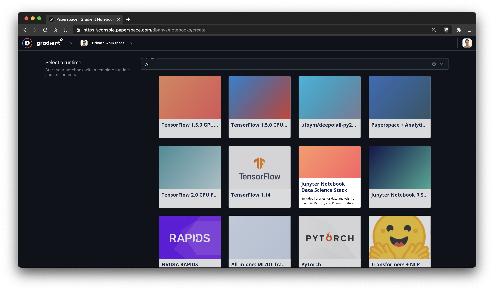
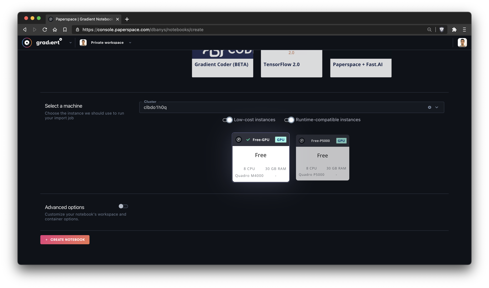
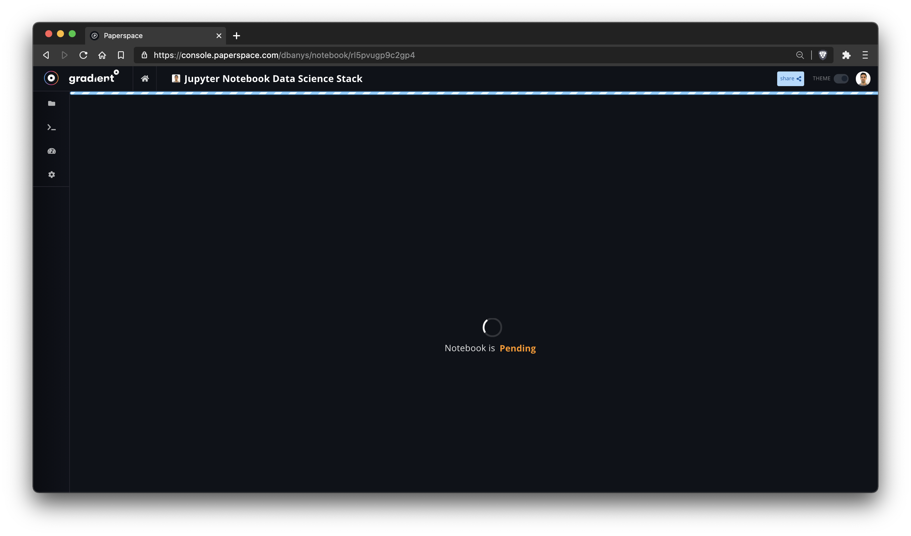

# Getting Started with Notebooks



## **Objectives**

* Launch a Jupyter Notebook with a single click
* Access existing datasets available within Gradient
* Train a machine learning model
* Save the model for inferencing


This example is available in our ML Showcase!  You can clone the notebook [here](https://ml-showcase.paperspace.com/projects/logistic-regression-with-scikit-learn). 


## **Introduction**

Gradient provides one-click access to Jupyter Notebooks. You can choose pre-configured environments to launch Notebook instances or create a container with custom environments.

In this walkthrough, we will launch a Jupyter Notebook to train a logistic regression model based on the MNIST dataset. Gradient comes with a set of datasets that are readily available at the `/datasets` location. Instead of downloading the MNIST dataset to local storage, we will access the existing dataset.

We will also learn how to save the model for inferencing by persisting the final joblib file to the `/storage` location.

You can [download ](https://drive.google.com/file/d/14vO3W3l7Ap2nLcerchqm8PTfuSrQXW0e/view?usp=sharing)the completed Jupyter Notebook and upload it to the VM. 

## Launching a Notebook Instance

Select the Gradient product and then click on the **Notebooks** tab to create a new notebook.

After naming your notebook, the next step is to choose a pre-configured environment or container.

Within the container picker, select **Filter &gt; All** and then locate the container called **Jupyter Notebook Data Science Stack.** This container will come with the core modules needed for our model.

In the next step, choose the machine type. Since we don’t need high-end machines with GPUs, we can choose a low-cost instance. Select the **Free GPU** machine to access free GPU instances.

The notebook will now provision. The notebook status will be **Provisioning** or **Pending** for a minute or two.

We are now ready to launch the Notebook. Choose Python 3 option under the  Notebooks section.

Rename the Notebook to give it a meaningful name. We are now ready to train the model.

## Training the Model 

Start by importing the modules. We are using Scikit-learn and relevant modules for this model. Since the environment doesn’t have _joblib_ module, we will install it before using it. This is a one-time task that needs to run at the beginning of the training job.

Next, we will create a couple of helper functions that load the dataset and changes the shape as expected by Scikit-learn.

We will now load the MNIST dataset from `/datasets` location. You can browse the files within the Jupyter environment.

The _loadMNIST_ helper function loads the dataset and converts into a NumPy array.

Let us verify if the dataset is loaded correctly by randomly visualizing a few data points.

Before we pass the training and test data to Scikit-learn Logistic Regression object, we need to reshape it.

We are now ready to fit the data into a logistic regression model.

Let’s call the predict method to see how accurate our model is. We will use the output of this to generate a confusion matrix.

This prints a confusion matrix shown below:

Finally, we will persist the trained model at `/storage/mnist` for accessing it later. The model that is saved to `model.pkl` is available to other Notebooks and Jobs launched within your account.

You can use the Jupyter environment to navigate to the `/storage/mnist` directory to find the saved model.

