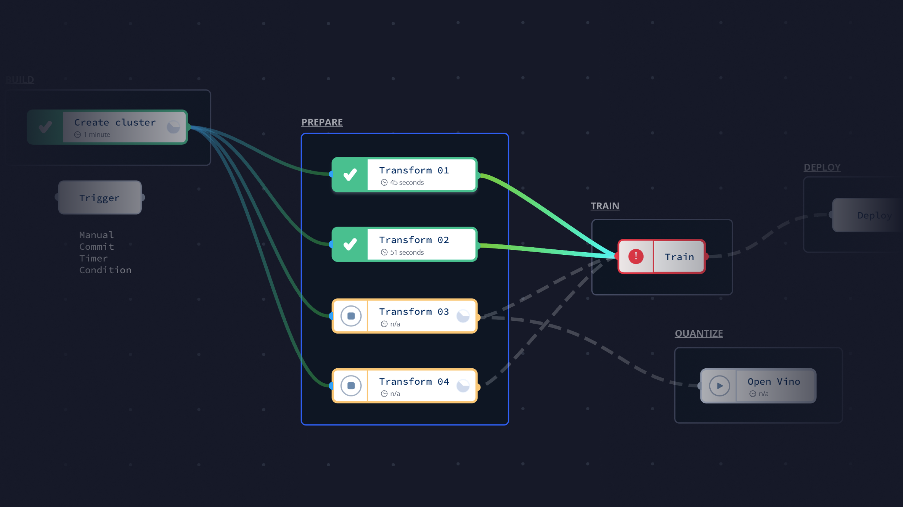

# Overview


This section of the documentation was for the **Worlflows (BETA)**. For the latest info on training in Gradient go to [Workflows](https://docs.paperspace.com/gradient/explore-train-deploy/workflows).


Workflows are the newest \(and most powerful\) way to create machine learning projects. Workflows let you use a [GitHub-action](https://docs.github.com/en/actions) style syntax to easily create powerful automation.

Workflows allow you to build complex, real-world machine learning projects. Note, this is an advanced topic so if you are still early in your ML journey, it might make more sense to start with [notebooks](../../tutorials/tutorials-list/getting-started-with-gradient-notebooks.md) first.

Workflows are based on the [Argo runtime engine](https://argoproj.github.io/projects/argo/) which is a container-native continuous delivery tool for Kubernetes. 

### Key Terminology

* **Workflow**: 
  * a named or unnamed entity that belongs to a team and project
  * named workflows can be re-run with a default `workflow spec`, or be passed a new spec every time
* [**Workflow Spec:**](workflow-spec.md)**:** a JSON or YAML list of jobs that is converted into an Argo template and run on the Gradient distributed runtime engine.
* [**Job**](workflow-spec.md#jobs)**:** self-contained part of a workflow spec that is similar to an Argo step
  * jobs can define inputs, outputs, and their own environment variables
* * jobs can require other jobs via "needs" and collect/pass info between jobs
  * jobs can be implemented with an action via "use"
* [**Action**](gradient-actions.md)**:** A self-contained, composable set of code building blocks that can perform specific actions within a machine learning project. 
* * actions can receive parameters \(e.g. args, image\) within the job step via the "with" argument
  * e.g. `container@v1` action = run a container, load inputs, and produce outputs
* [**Workflow Run**](workflow-spec.md#example-workflow-run-output): the implementation of a workflow
  * the most basic run requires a `workflowId` and `clusterId` - most will also include a workflowSpec and the inputs to be passed into the workflow
  * the workflow run contains everything needed for the workflow to actually be executed; i.e. what \(`workflowId`\), where \(`clusterId`\), how \(`workflowSpec`\) with \([inputs](workflow-spec.md#inputs), etc.\)

